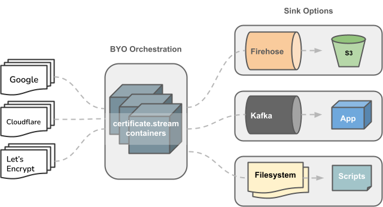

# certificate.stream


<b>TLS certificate transparency monitoring for everybody.</b>

Set up a Log Sink (Firehose, Kafka, ...), Run the certificate.stream container(s), and Start consuming certificates.



## Premise

certificate.stream's mission is to provide an easy-to-use, open-source certificate transparency log monitoring tool to help you and your organization combat phishing and typosquatting.

> "In 2021, the total number of phishing and counterfeit pages detected increased 1.5x over 2020 to a total of more than 10.5 million — and it continues to grow..." — [Security Boulevard](https://securityboulevard.com/2022/03/what-is-domain-monitoring-and-why-you-need-it/)

With the ever-increasing number of phishing websites, brand protection is becoming a top priority for cybersecurity departments everywhere. In order to stay ahead of these threats, many organizations implement domain monitoring solutions that go above and beyond monitoring their own digital assets.

> "Domain monitoring entails much more than keeping an eye on registration expiry dates for the domains in your possession. Domain protection requires a domain monitoring solution that looks outside to ensure the parts you don’t use aren’t being used against you." — [Security Boulevard](https://securityboulevard.com/2022/03/what-is-domain-monitoring-and-why-you-need-it/)

By monitoring the certificate-transpareny logs, cybersecurity teams can rapidly detect a bad actor's intent to <i>[typosquat](https://en.wikipedia.org/wiki/Typosquatting)</i> their organization's name and potentially damage the organization's reputation or mislead its customers.

## Quickstart

### Examples

Start by checking out `local/`.
This directory contains end-to-end implementations that can be run locally with 🐋 Docker.

### Log Operators

Log operators maintain an open list of certificates that can be retrieved over HTTPS. By default, "all" usable logs are polled, but if you want more granularity, you can specify which operators certificate.stream should poll using the `-o` flag. This is useful for splitting logs across multiple services/nodes in an orchestrated environment.

Container/Service A:
`certificate stream -s kafka -o google,digicert,trustasia`

Container/Service B:
`certificate stream -s kafka -o cloudflare,sectigo,letsencrypt`

Find the current list of <b>usable</b> logs: https://certificate.transparency.dev/logs/

### JSON Log Schema

Each certificate pulled from the CT Logs is converted into the following schema and sent in batches to the configured Sink:

```json
{
    "entry_type": "X509Cert",
    "body": {
        "cert_leaf": {
            "subject": {
                "aggregated": "CN=c77db80a6749e75ba111a99a.keenetic.io",
                "C": "",
                "ST": "",
                "L": "",
                "O": "",
                "OU": "",
                "CN": "c77db80a6749e75ba111a99a.keenetic.io"
            },
            "extensions": {
                "basicConstraints": "CA:false",
                "keyUsage": "Digital Signature, Key Encipherment",
                "authorityInfoAccess": "CA Issuers - URI:http://r3.i.lencr.org/OCSP - URI:http://r3.o.lencr.org",
                "authorityKeyIdentifier": "keyid:142eb317b75856cbae500940e61faf9d8b14c2c6",
                "certificatePolicies": "Policy: 2.23.140.1.2.1",
                "subjectKeyIdentifier": "keyid:551e3034981c33b5a825b6077e548f1cbc4e0c0a",
                "subjectAltNames": "DNS:*.c77db80a6749e75ba111a99a.keenetic.io, DNS:c77db80a6749e75ba111a99a.keenetic.io"
            },
            "not_before": "2024-03-10T21:04:13Z",
            "not_after": "2024-06-08T21:04:12Z",
            "as_der": "MIIFPjCCBCagAwIBAgISA/G47m1LCi4QaC7DqTVFI9hwMA0GCSqGSIb3DQEBCwUAMDIxCzAJBgNVBAYTAlVTMRYwFAYDVQQKEw1MZXQncyBFbmNyeXB0MQswCQYDVQQDEwJSMzAeFw0yNDAzMTAyMTA0MTNaFw0yNDA2MDgyMTA0MTJaMC8xLTArBgNVBAMTJGM3N2RiODBhNjc0OWU3NWJhMTExYTk5YS5rZWVuZXRpYy5pbzCCASIwDQYJKoZIhvcNAQEBBQADggEPADCCAQoCggEBAM2lPR4isp6xQzeyDIDnGaXLm6UYl2wvrbV3uj57EeRUph19Nt7g17jVhA+l3IcP5pW2fEA4oNBbnuKRW578ZY+KrRJZW/8hIXYeybPDLWLbdxvHA3Hj1q4nQxawRA/3uHmQQDKM0RvoNBT9j1Wy2yA0iG7Re2aySpTLPYDwVafKhwxUKD1tawcl/TfKwnb+UmKztPCz4aZmiToIbsIlUaSfrgnsY6TGH03EgoOmGEuI6FQ3HLqcE2Ogi8S6cPiWaoFLblmW3VHYHYbjFCzCkU3jC1bVRGwSuflyCnY6PO2hfrzSzOWATGw1ZGpciR1l6wwXkDk1mcxQeu2DRYCncp0CAwEAAaOCAk8wggJLMA4GA1UdDwEB/wQEAwIFoDAdBgNVHSUEFjAUBggrBgEFBQcDAQYIKwYBBQUHAwIwDAYDVR0TAQH/BAIwADAdBgNVHQ4EFgQUVR4wNJgcM7WoJbYHflSPHLxODAowHwYDVR0jBBgwFoAUFC6zF7dYVsuuUAlA5h+vnYsUwsYwVQYIKwYBBQUHAQEESTBHMCEGCCsGAQUFBzABhhVodHRwOi8vcjMuby5sZW5jci5vcmcwIgYIKwYBBQUHMAKGFmh0dHA6Ly9yMy5pLmxlbmNyLm9yZy8wVwYDVR0RBFAwToImKi5jNzdkYjgwYTY3NDllNzViYTExMWE5OWEua2VlbmV0aWMuaW+CJGM3N2RiODBhNjc0OWU3NWJhMTExYTk5YS5rZWVuZXRpYy5pbzATBgNVHSAEDDAKMAgGBmeBDAECATCCAQUGCisGAQQB1nkCBAIEgfYEgfMA8QB3ADtTd3U+LbmAToswWwb+QDtn2E/D9Me9AA0tcm/h+tQXAAABjiplHx0AAAQDAEgwRgIhAIeGWCuRYAl9mz22KKVub45uOUhcmith7b2ci3WKI+NKAiEAzgX+UTaK/39rL1jm8tUDAw1AolFeK33c0YDObKjx/joAdgCi4r/WHt4vLweg1k5tN6fcZUOwxrUuotq3iviabfUX2AAAAY4qZR+aAAAEAwBHMEUCIQC/AWwLY+OBsuCiBai3oVvj3ktvTqPcNGK7TGgX8IhJ0QIgTrHuQh6QtD3PEvBQIxi6LBm4/Dvbp9hftKPY8rzn08UwDQYJKoZIhvcNAQELBQADggEBAIPdSAlvknz7hix26GLFuKFqk2jR9+tjw9yNllZGI3VNyp0VA0a4pjToJqNBDAEMQpBQWu4El9WllLFXGd3m0BzO0MJaEAYCdCiJkvoedY6mVpU3eI/H/DTy2KmeL1SlG9RdaRuOArTAdz61aAW75BWCbWaQjGnnxsRTuywY9M1B8rwepjJMJbqjDsUCfD3bFtWOFs/e03apZr5liIWTWy31tqan48vU2tt/Do/DXq6S07YQzwcblVKDfZQN1KnhIztZ033fs1udAk88J3r5hCKzCioFkTSCK72FzpedByWpy68+sVheY4AqzeeF0UmEghGbbzU7nkxYw6Rwi9dgGBc=",
            "domains": [
                "*.c77db80a6749e75ba111a99a.keenetic.io",
                "c77db80a6749e75ba111a99a.keenetic.io"
            ]
        },
        "cert_chain": [
            {
                "subject": {
                    "aggregated": "C=US, O=Let's Encrypt, CN=R3",
                    "C": "US",
                    "ST": "",
                    "L": "",
                    "O": "Let's Encrypt",
                    "OU": "",
                    "CN": "R3"
                },
                "extensions": {
                    "basicConstraints": "CA:true, pathlen:0",
                    "keyUsage": "Digital Signature, Certificate Signing, CRL Signing",
                    "authorityInfoAccess": "CA Issuers - URI:http://x1.i.lencr.org/",
                    "authorityKeyIdentifier": "keyid:79b459e67bb6e5e40173800888c81a58f6e99b6e",
                    "certificatePolicies": "Policy: 2.23.140.1.2.1Policy: 1.3.6.1.4.1.44947.1.1.1",
                    "crlDistributionPoints": "Full Name:URI:http://x1.c.lencr.org/",
                    "subjectKeyIdentifier": "keyid:142eb317b75856cbae500940e61faf9d8b14c2c6"
                },
                "not_before": "2020-09-04T00:00:00Z",
                "not_after": "2025-09-15T16:00:00Z",
                "as_der": "MIIFFjCCAv6gAwIBAgIRAJErCErPDBinU/bWLiWnX1owDQYJKoZIhvcNAQELBQAwTzELMAkGA1UEBhMCVVMxKTAnBgNVBAoTIEludGVybmV0IFNlY3VyaXR5IFJlc2VhcmNoIEdyb3VwMRUwEwYDVQQDEwxJU1JHIFJvb3QgWDEwHhcNMjAwOTA0MDAwMDAwWhcNMjUwOTE1MTYwMDAwWjAyMQswCQYDVQQGEwJVUzEWMBQGA1UEChMNTGV0J3MgRW5jcnlwdDELMAkGA1UEAxMCUjMwggEiMA0GCSqGSIb3DQEBAQUAA4IBDwAwggEKAoIBAQC7AhUozPaglNMPEuyNVZLD+ILxmaZ6QoinXSaqtSu5xUyxr45r+XXIo9cPR5QUVTVXjJ6oojkZ9YI8QqlObvU7wy7bjcCwXPNZOOftz2nwWgsbvsCUJCWH+jdxsxPnHKzhm+/b5DtFUkWWqcFTzjTIUu61ru2P3mBw4qVUq7ZtDpelQDRrK9O8ZutmNHz6a4uPVymZ+DAXXbpyb/uBxa3Shlg9F8fnCbvxK/eG3MHacV3URuPMrSXBiLxgZ3Vms/EY96Jc5lP/Ooi2R6X/ExjqmAl3P51T+c8B5fWmcBcUr2Ok/5mzk53cU6cG/kiFHaFpriV1uxPMUgP17VGhi9sVAgMBAAGjggEIMIIBBDAOBgNVHQ8BAf8EBAMCAYYwHQYDVR0lBBYwFAYIKwYBBQUHAwIGCCsGAQUFBwMBMBIGA1UdEwEB/wQIMAYBAf8CAQAwHQYDVR0OBBYEFBQusxe3WFbLrlAJQOYfr52LFMLGMB8GA1UdIwQYMBaAFHm0WeZ7tuXkAXOACIjIGlj26ZtuMDIGCCsGAQUFBwEBBCYwJDAiBggrBgEFBQcwAoYWaHR0cDovL3gxLmkubGVuY3Iub3JnLzAnBgNVHR8EIDAeMBygGqAYhhZodHRwOi8veDEuYy5sZW5jci5vcmcvMCIGA1UdIAQbMBkwCAYGZ4EMAQIBMA0GCysGAQQBgt8TAQEBMA0GCSqGSIb3DQEBCwUAA4ICAQCFyk5HPqP3hUSFvNVneLKYY611TR6WPTNlclQtgaDqw+34IL9fzLdwALduO/ZelN7kIJ+m74uyA+eitRY8kc607TkC53wlikfmZW4/RvTZ8M6UK+5UzhK8jCdLuMGYL6KvzXGRSgi3yLgjewQtCPkIVz6D2QQzCkcheAmCJ8MqyJu5zlzyZMjAvnnAT45tRAxekrsu94sQ4egdRCnbWSDtY7kh+BImlJNXoB1lBMEKIq4QDUOXoRgffuDghje1WrG9ML+Hbisq/yFOGwXD9RiX8F6sw6W4avAuvDszue5L3sz85K+EC4Y/wFVDNvZo4TYXao6Z0f+lQKc0t8DQYzk1OXVu8rp2yJMC6alLbBfODALZvYH7n7do1AZls4I9d1P4jnkDrQoxB3UqQ9hVl3LEKQ73xF1OyK5GhDDX8oVfGKF5u+decIsH4YaTw7mP3GFxJSqv3+0lUFJoi5Lc5da149p90IdshCExroL1+7mryIkXPeFM5TgO9r0rvZaBFOvV2z0gp35Z0+L4WPlbuEjN/lxPFin+HlUjr8gRsI3qfJOQFy/9rKIJR0Y/8Omwt/8oTWgy1mdeHmmjk7j1nYsvC9JSQ6ZvMldlTTKB3zhThV1+XWYp6rjd5JW1zbVWEkLNxE7GJThEUG3szgBVGP7pSWTUTsqXnLRbwHOoq7hHwg=="
            },
            {
                "subject": {
                    "aggregated": "C=US, O=Internet Security Research Group, CN=ISRG Root X1",
                    "C": "US",
                    "ST": "",
                    "L": "",
                    "O": "Internet Security Research Group",
                    "OU": "",
                    "CN": "ISRG Root X1"
                },
                "extensions": {
                    "basicConstraints": "CA:true",
                    "keyUsage": "Certificate Signing, CRL Signing",
                    "subjectKeyIdentifier": "keyid:79b459e67bb6e5e40173800888c81a58f6e99b6e"
                },
                "not_before": "2015-06-04T11:04:38Z",
                "not_after": "2035-06-04T11:04:38Z",
                "as_der": "MIIFazCCA1OgAwIBAgIRAIIQz7DSQONZRGPgu2OCiwAwDQYJKoZIhvcNAQELBQAwTzELMAkGA1UEBhMCVVMxKTAnBgNVBAoTIEludGVybmV0IFNlY3VyaXR5IFJlc2VhcmNoIEdyb3VwMRUwEwYDVQQDEwxJU1JHIFJvb3QgWDEwHhcNMTUwNjA0MTEwNDM4WhcNMzUwNjA0MTEwNDM4WjBPMQswCQYDVQQGEwJVUzEpMCcGA1UEChMgSW50ZXJuZXQgU2VjdXJpdHkgUmVzZWFyY2ggR3JvdXAxFTATBgNVBAMTDElTUkcgUm9vdCBYMTCCAiIwDQYJKoZIhvcNAQEBBQADggIPADCCAgoCggIBAK3oJHP0FDfzm54rVygch77ct984kIxuPOZXoHj3dcKi/vVqbvYATyjb3miGbESTtrFj/RQSa78f0uoxmyF+0TM8ukj13Xnfs7j/EvEhmkvBioZxaUpmZmyPfjxwv60pIgbz5MDmgK7iS4+3mX6UA5/TR5d8mUgjU+g4rk8Kb4Mu0UlXjIB0ttov0DiNewNwIRt18jA8+o+u3dpjq+sWT8KOEUt+zwvo/7V3LvSye0rgTBIlDHCNAymg4VMk7BPZ7hm/ELNKjD+Jo2FR3qyHB5T0Y3HsLuJvW5iB4YlcNHlsdu87kGJ55tukmi8mxdAQ4Q7e2RCOFvu396j3x+UCB5iPNgiV5+I3lg02dZ77DnKxHZu8A/lJBdiB3QW0KtZB6awBdpUKD9jf1b0SHzUvKBds0pjBqAlkd25HN7rOrFleaJ1/ctaJxQZBKT5ZPt0m9STJEadao0xAH0ahmbWnOlFuhjuefXKnEgV4We0+UXgVCwOPjdAvBbI+e0ocS3MFEvzG6uBQE3xDk3SzynTnjh8BCNAw1FtxNrQHusEwMFxIt4I7mKZ9YIqioymCzLq9gwQbooMDQaHWBfEbwrbwqHyGO0aoSCqI3Haadr8faqU9GY/rOPNk3sgrDQoo//fb4hVC1CLQJ13hef4Y53CIrU7m2Ys6xt0nUW7/vGT1M0NPAgMBAAGjQjBAMA4GA1UdDwEB/wQEAwIBBjAPBgNVHRMBAf8EBTADAQH/MB0GA1UdDgQWBBR5tFnme7bl5AFzgAiIyBpY9umbbjANBgkqhkiG9w0BAQsFAAOCAgEAVR9YqbyyqFDQDLHYGmkgJykIrGF1XIpu+ILlaS/V9lZLubhzEFnTIZd+50xx+7LSYK05qAvqFyFWhfFQDlnrzuBZ6brJFe+GnY+EgPbk6ZGQ3BebYhtF8GaV0nxvwuo77x/Py9auJ/GpsMiu/X1+mvoiBOv/2X/qkSsisRcOj/KKNFtY2PwByVS5uCbMiogziUwthDyC3+6WVwW6LLv3xLfHTjuCvjHIInNzktHCgKQ5ORAzI4JMPJ+GslWYHb4phowim57iaztXOoJwTdwJx4nLCgdNbOhdjsnvzqvHu7UrTkXWStAmzOVyyghqpZXjFaH3pO3JLF+l+/+sKAIuvtd7u+Nxe5AW0wdeRlN8NwdCjNPElpzVmbUq4JUagEiuTDkHzsxHpFKVK7q4+63SM1N95R1NbdWhscdCb+ZAJzVcoyi3B43njTOQ5yOf+1CceWxG1bQVs5ZufpsMljq4Ui0/1lvh+wjChP4kqKOJ2qxq4RgqsahDYVvTH9w7jXbyLeiNdd8XM2w9U/t7y0Ff/9yi0GE44Za4rF2LN9d11TPAmRGunUHBcnWEvgJBQl9nJEiU0Zsnvgc/ubhPgXRR4Xq37Z0j4r7g1SgEEzwxA57demyPxgcYxn/eR44/KJ4EBs+lVDR3veyJm+kXQ99b21/+jh5Xos1AnX5iItreGCc="
            }
        ],
        "index": 1277934158,
        "date": "2024-03-10",
        "issued_at": "2024-03-10T21:04:13Z",
        "source": {
            "url": "https://ct.googleapis.com/logs/eu1/xenon2024",
            "name": "Google"
        }
    }
}
```

### Sink Options

There are currently 3 sink options available:
- AWS Firehose
- Apache Kafka
- File

Sink configurations are handled via environment variables. Reference the docker-compose files examples in `local/` for environment variables required for each sink. 

If you'd like to see more Sink options, open an issue requesting the new option.

## Credits

#### [google/certificate-transparency-go](https://github.com/google/certificate-transparency-go)
Much of the core design of certificate.stream is pulled from [google/certificate-transparency-go](https://github.com/google/certificate-transparency-go).
The major difference being that `google/certificate-transparency-go` is a more complete toolkit for everything certificate-transparency, whereas this repo is more focused on containerizing the certificate monitoring piece and not the other actions (DNS querys, Scanning tools, Verifying certificates, etc.) directly against the CT Logs.

#### [calidog/certstream-python](https://github.com/CaliDog/certstream-python)
The `certstream` library is a great resource for certificate monitoring with many active maintainers. The `certstream` project is what inspired this project! You can set up robust monitoring consumer applications using `certstream` with different programming languages.

## Contributions

Pull requests, Issues, Enhancements, Suggestions, Questions are all welcome. Thanks!
